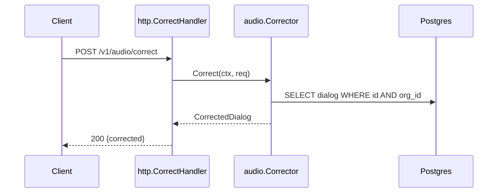

# Artifact templates

Jump to the template for the artifact you're writing — a lane needs only its own.

| Artifact | Written by | Limit |
|---|---|---|
| [`base/brief.md`](#basebriefmd--max-2-pages) | synthesis (step 7) | 2 pages |
| [`base/structure.md`](#basestructuremd) | lane B1 | 1 page |
| [`base/data.md`](#basedatamd) | lane B2 | 2 pages |
| [`base/domain.md`](#basedomainmd) | lane B3 | 1 page |
| [`base/crosscutting.md`](#basecrosscuttingmd) | lane B4 | 2 pages |
| [`base/history.md`](#basehistorymd) | lane B5 | 1 page |
| [`slices/<slug>.md`](#slicesslugmd) | lanes S1–S4, merged | 3 pages |
| [`MANIFEST.json`](#manifestjson) | step 6 | — |

Required shape for every file in `.hst/kb/`. Three rules apply everywhere:

- **Every claim carries evidence** — `path/file.go:142`, or the command that produced it.
- **Confidence tags** where the level isn't obvious: `VERIFIED` (read the code) · `INFERRED` (deduced from strong signals) · `ASSUMPTION` (plausible, unconfirmed, load-bearing) · `UNKNOWN` (tried, failed).
- **Lanes omit the header `sha:`** and report a `files:` list instead. The orchestrator stamps one SHA across every artifact it wrote (step 6); a lane cannot know it, and per-lane SHAs would disagree if the tree moved mid-run. The `files` list is the opposite — only the lane knows what it actually read.

Size limits are real. An artifact that outgrows its limit is a signal the scope was too wide, not a reason to raise the limit.

---

## `base/brief.md` — max 2 pages

The only base file loaded in full on every run. Everything else is read just-in-time.

```markdown
# <project> — brief
<!-- sha: 8ba8995 · generated: 2026-08-03 -->

## What it is
<3-5 lines: what the system does, for whom, and its one-sentence reason to exist.
Written so a competent engineer who has never seen it can hold it in their head.>

## Stack
| Layer | Choice | Version | Evidence |
|---|---|---|---|
| Language | Go | 1.23 | go.mod:3 |
| DB | Postgres | 16 | docker-compose.yml:12 |

## Run it
```
make dev          # starts app + postgres
make test         # full suite
```

## Glossary
Domain terms as this codebase uses them — not their generic meanings.

| Term | Means here | Evidence |
|---|---|---|
| Settlement | the nightly batch that nets positions | internal/settle/doc.go:1 |

**Collisions — record these even when they seem obvious.** A term that means two
things in one repo silently corrupts every grep-driven search, and each individual
citation still looks correct, so nothing flags the mix.

| Term | Also means | Which is out of scope |
|---|---|---|
| correction | a per-machine stress-dictionary patch in the NLP service | the NLP one — docs/stress-corrections.md |

## Top gotchas
The things that make a newcomer's first change wrong. 5-10 max, most dangerous first.

1. Every query must be tenant-scoped — `internal/db/scope.go:31`. Bypassing `Scoped()` leaks data across orgs. `VERIFIED`
2. `internal/legacy/` is frozen pending migration — do not extend it. `docs/adr/0009.md` `VERIFIED`
```

---

## `base/structure.md`

```markdown
# Structure & tooling
<!-- sha: 8ba8995 -->

## Layout
| Path | Holds | Notes |
|---|---|---|
| `cmd/api/` | HTTP entry point | main.go wires everything |
| `internal/` | app code, not importable externally | |
| `internal/legacy/` | frozen | see ADR 0009 |

## Commands
| Task | Command | Source |
|---|---|---|
| Build | `make build` | Makefile:12 |
| Test | `make test` | Makefile:18 |
| Lint | `golangci-lint run ./...` | .github/workflows/ci.yml:34 |

Prefer the project's own wrapper over the generic tool invocation — the wrapper usually
carries setup the generic form skips.

## Generated code
| What | Generated by | Command | Committed? |
|---|---|---|---|
| `internal/db/sqlc/` | sqlc | `make gen` | yes |

Editing generated files by hand is a defect. Say so explicitly here.

## Runtime & deployment
How it runs locally, what external services it needs, required env vars, where it runs
in production. See references/detection.md § Deployment & runtime.
```

---

## `base/data.md`

```markdown
# Data model
<!-- sha: 8ba8995 · files: migrations/, atlas.hcl -->

## Migration tool
**Atlas** — `atlas.hcl:1`.
- Apply: `atlas migrate apply --env local`
- New migration: `atlas migrate diff <name> --env local`
- Canonical schema: `migrations/` (versioned); no checked-in schema.sql
- Applied on deploy: separate step, `.github/workflows/deploy.yml:41` `VERIFIED`

## ERD
Only the tables in scope plus their immediate neighbours. A whole-schema ERD is noise.

```mermaid
erDiagram
    ORG ||--o{ USER : has
    USER ||--o{ SESSION : owns
    ORG { uuid id PK }
    USER { uuid id PK, uuid org_id FK, text email }
```

## Tables
### `users` — migrations/0004_users.sql:1
| Column | Type | Constraints | Notes |
|---|---|---|---|
| id | uuid | PK | |
| org_id | uuid | FK → orgs, NOT NULL | tenancy key |
| email | text | UNIQUE (org_id, email) | unique per org, not globally |

## Invariants
Rules the schema enforces, and rules it does not enforce but the code assumes.
The second kind matters more — nothing fails loudly when they break.

- `users.email` is unique per org, not globally — `migrations/0004:12` `VERIFIED`
- Soft deletes: `deleted_at` set, rows never removed; most queries filter it,
  `internal/db/scope.go:44`. `INFERRED` — not enforced at the DB level.

## Scale
Row counts, growth, hot tables, indexes that matter. `UNKNOWN` if not determinable
from the repo — an ASSUMPTION about scale is how N+1s reach production.
```

---

## `base/domain.md`

```markdown
# Domain model
<!-- sha: 8ba8995 -->

## Mapping
| Table | Application type | Declared in | Notes |
|---|---|---|---|
| `users` | `domain.User` | internal/domain/user.go:11 | distinct from the DB row type |
| `users` | `db.UserRow` | internal/db/sqlc/models.go:22 | generated |

## Separation
Is the domain model distinct from persistence, or are ORM entities used directly in
business logic? State which, with evidence. This decides where a change belongs.

## Where logic lives
Where it *actually* is, not where the framework says it should be.

| Concern | Lives in | Evidence |
|---|---|---|
| User validation | domain layer | internal/domain/user.go:40 |
| Signup orchestration | service layer | internal/service/signup.go:18 |
| Some validation | duplicated in the handler | internal/http/signup.go:55 `VERIFIED` — drift worth flagging |

## Aggregates & transaction units
What loads and saves together, and who owns the transaction boundary.
```

---

## `base/crosscutting.md`

The highest-value artifact. Each concern gets a mechanism and a citation, or `UNKNOWN`
— which is itself a finding, since it means the codebase has no consistent approach.

```markdown
# Cross-cutting concerns
<!-- sha: 8ba8995 -->

## Authentication
JWT in `Authorization: Bearer`, verified in `internal/http/mw/auth.go:28`.
Identity lands in the request context as `mw.Principal`. `VERIFIED`

## Multi-tenancy
**Every query must be tenant-scoped.** `internal/db/scope.go:31` wraps the querier;
handlers get a pre-scoped querier from the middleware. A raw `db.Queries` bypasses
scoping entirely and nothing stops you — `internal/db/scope.go:12` `VERIFIED`

## Transactions
Owned by the service layer, not handlers — `internal/service/tx.go:20`. Nested calls
join the outer transaction. Handlers must not open one.

## Idempotency
Consumers dedupe on `message_id` in `processed_messages` —
`internal/consume/dedup.go:14`. Delivery is at-least-once. `VERIFIED`

## Retries · Errors · Observability · Config · Caching · Validation · Concurrency
<same shape; see references/detection.md § Cross-cutting concerns for the checklist>
```

---

## `base/history.md`

```markdown
# History
<!-- sha: 8ba8995 -->

## Hotspots
Churn × size, last 12 months. Where the work actually concentrates.

| File | Commits | Lines | Score | Read this because |
|---|---|---|---|---|
| internal/audio/correct.go | 47 | 820 | 38540 | central to the slice, changes constantly |

## Change coupling
Files that keep changing together — dependencies no static read reveals.

| A | B | Together | Why |
|---|---|---|---|
| internal/audio/correct.go | internal/audio/correct_test.go | 41/47 | test moves with code |
| internal/audio/correct.go | migrations/ | 9/47 | this logic is schema-coupled |

## Decisions (ADRs)
| ADR | Decides | Why it matters |
|---|---|---|
| 0009 | freeze internal/legacy/ | do not extend; it's being migrated out |

## Deprecated / frozen zones
Paths not to extend, and what to use instead.

## Intent behind odd code
`--deep` only. From `git log -p` on the hotspots: things that look wrong but aren't.
```

---

## `slices/<slug>.md`

The per-task artifact and the source of the in-session brief.

```markdown
# <slug>
<!-- sha: 8ba8995 · source: https://github.com/org/repo/issues/482 · depth: standard -->

## Task
**Intent:** <what the ticket actually asks for>
**Acceptance criteria:**
- [ ] <verbatim from the ticket — do not paraphrase away a constraint>

## Prior art
| Commit | Touched | Relevance |
|---|---|---|
| a3f91c2 | internal/audio/correct.go | PROJ-1802, same subsystem |

## Flow

One diagram per flow. If it needs more than ~12 participants, the slice is too wide.

## Contracts
### In — `POST /v1/audio/correct` · internal/http/audio.go:31
| Field | Type | Required | Notes |
|---|---|---|---|
| dialog_id | uuid | yes | must belong to caller's org |

### Out — 200 · internal/http/audio.go:78
<response shape; error envelope; status codes>

For async slices: topic/queue, schema, ordering, delivery semantics, retries, DLQ.

## Change surface
| File | Why | Blast radius |
|---|---|---|
| internal/audio/correct.go:120-180 | the logic itself | 3 callers, all in internal/service |
| internal/audio/correct_test.go | tests move with it | — |
| migrations/ | only if the fix needs a column | schema change → deploy ordering matters |

## Rules you must not break
Concrete and citable, not a list of topics. These are what an unprimed session gets wrong.

1. Query must go through `Scoped()` — `internal/db/scope.go:31`. `VERIFIED`
2. Handler must not open a transaction; the service owns it — `internal/service/tx.go:20`. `VERIFIED`

## Tests
**Run just these:** `go test -run TestCorrect ./internal/audio`

| Test | Encodes | File |
|---|---|---|
| TestCorrect_EmptyDialog | empty input → empty output, no error | correct_test.go:22 |
| TestCorrect_CrossOrg | cross-org dialog → 404, not 403 | correct_test.go:88 |

**Gaps:** no test covers concurrent correction of the same dialog. `VERIFIED`

## Contradictions
Where docs and code disagree. Worth surfacing even when unrelated to the task —
a stale doc actively steers later sessions wrong.

- README.md:44 says corrections are async; `internal/http/audio.go:31` handles them
  synchronously. Code wins. `VERIFIED`

## Open questions
| # | Question | Tag | Blocks? |
|---|---|---|---|
| 1 | Should cross-org return 404 or 403? Tests say 404, ticket implies 403 | `ASSUMPTION` | yes |
| 2 | Is there a rate limit on this endpoint? | `UNKNOWN` | no |

## Skipped
- `vendor/` excluded (12k files)
- Read 4 of 11 test files in internal/audio — the 4 covering the changed path
```

---

## `MANIFEST.json`

JSON rather than YAML so `scripts/kb.py` can parse it with no third-party dependency.
It is machine-written and machine-read; nobody should need to hand-edit it.

```json
{
  "generated_at": "2026-08-03T10:22:11Z",
  "head_sha": "8ba8995",
  "base": {
    "brief.md":        {"sha": "8ba8995", "depth": "standard", "files": ["README.md", "go.mod"]},
    "structure.md":    {"sha": "8ba8995", "depth": "standard", "files": ["go.mod", "Makefile", "cmd/"]},
    "data.md":         {"sha": "8ba8995", "depth": "standard", "files": ["migrations/", "atlas.hcl"]},
    "domain.md":       {"sha": "8ba8995", "depth": "standard", "files": ["internal/domain/", "internal/db/"]},
    "crosscutting.md": {"sha": "8ba8995", "depth": "standard", "files": ["internal/http/mw/", "internal/db/scope.go"]},
    "history.md":      {"sha": "8ba8995", "depth": "standard", "files": []}
  },
  "slices": {
    "issue-482": {
      "sha": "8ba8995",
      "source": "https://github.com/org/repo/issues/482",
      "depth": "standard",
      "files": ["internal/audio/correct.go", "internal/audio/correct_test.go", "internal/http/audio.go"]
    }
  },
  "skipped": ["vendor/ — 12k files, excluded from all lanes"]
}
```

`files` must list every path a lane actually depended on — directories are fine for
lanes that swept them, and the helper matches them by prefix. **That list is the
staleness check.** A path omitted here is a claim that will go stale silently, which is
worse than having no claim at all, because stale knowledge is trusted just as much as
fresh knowledge.

`history.md` takes `"files": []` because it derives from commit metadata rather than
file contents. The helper treats an empty list as never-stale, which means `history.md`
would otherwise be written once on the cold path and never again — refresh it with
`--refresh-base`, or on `--deep`, or when the commit count has moved materially.

`.lanes/` holds the raw lane reports and is deliberately absent from the manifest: it is
scratch, deleted once the artifacts are written (kept under `--deep` for auditability).
It exists so an interrupted run resumes by reading files rather than by re-running or
re-requesting every lane — the reports are the most expensive thing the pass produces.
